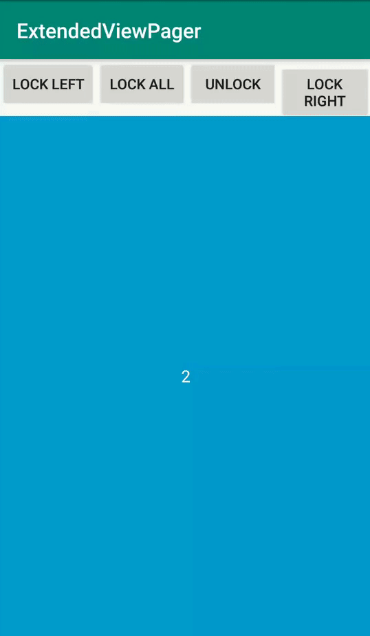

# ControlledViewPager
	
Extended ViewPager with swipe disabling options

DEMO
---



USAGE
---

Using ControlledViewPager in your application.
Add dependencies in build.gradle of your module.

```groovy
dependencies {
  implementation 'com.riningan.widget:controlledviewpager:1.0'
}
```

XML
-----

```xml
<com.riningan.widget.ControlledViewPager
    android:layout_width="match_parent"
    android:layout_height="match_parent"
    app:swipe_direction="all" />
```

```xml
<attr name="swipe_direction" format="enum" >
    <enum name="all" value="0"/>
    <enum name="left" value="1"/>
    <enum name="right" value="2"/>
    <enum name="none" value="3"/>
</attr>
```

Property **swipe_direction** set allowed swipe direction:

* `all` - work like default ViewPager
* `left` - disable right swipe
* `right` - disable left swipe
* `none` - disable both swipe

JAVA
-----

```java
ControlledViewPager controlledViewPager = findViewById(R.id.controlledViewPager);
controlledViewPager.setAllowedSwipeDirection(ControlledViewPager.SwipeDirection direction);
```

```java
public enum SwipeDirection {
    All, LEFT, RIGHT, NONE
}
```

Property **setAllowedSwipeDirection** set allowed swipe direction:

* `All` - work like default ViewPager
* `LEFT` - disable right swipe
* `RIGHT` - disable left swipe
* `NONE` - disable both swipe

LICENCE
-----

  	Licensed under the Apache License, Version 2.0 (the "License");
	you may not use this file except in compliance with the License.
	You may obtain a copy of the License at
	
	   http://www.apache.org/licenses/LICENSE-2.0
	
	Unless required by applicable law or agreed to in writing, software
	distributed under the License is distributed on an "AS IS" BASIS,
	WITHOUT WARRANTIES OR CONDITIONS OF ANY KIND, either express or implied.
	See the License for the specific language governing permissions and
	limitations under the License.
